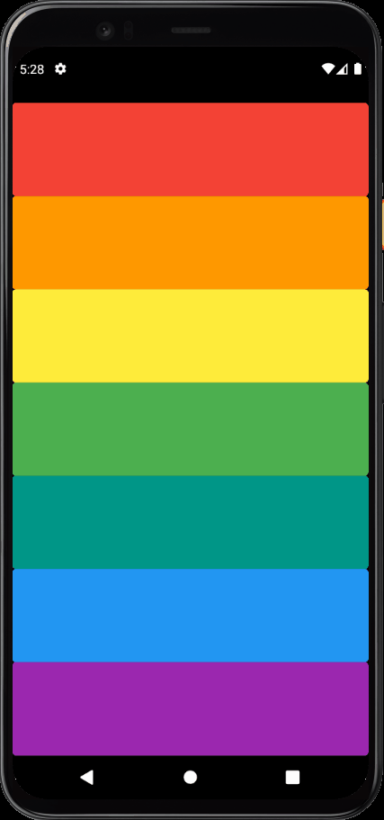

# Xylophone App - [](https://flutter.dev/)

<h1 align="center">
  <p>🎼🎵Xylophone App made with Flutter🎵🎼</p>
  
</h1>

# Features

- Single page to play "musical notes" for each button

## Getting Started

- Clone the repository
- run in cmd:
  ```cmd
  flutter pub get
  flutter run
  ```

## Dependencieis

| Lib          | Link                                                 |
| ------------ | ---------------------------------------------------- |
| audioplayers | [Audio Cache](https://pub.dev/packages/audioplayers) |

## Device

- Tested in Pixel 4 - Android 11
